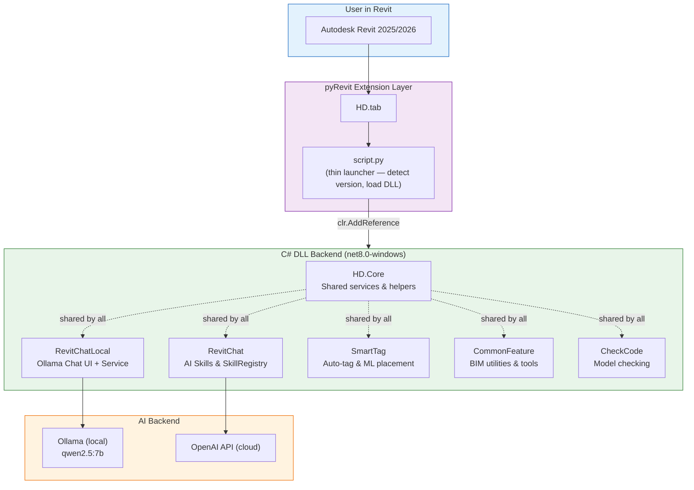
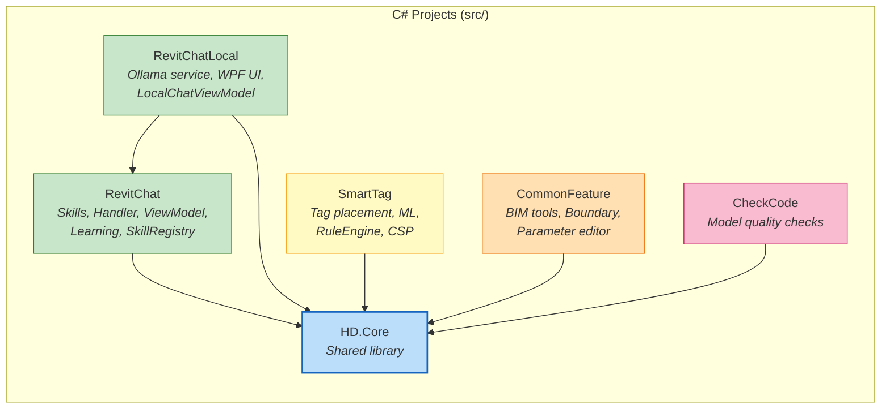
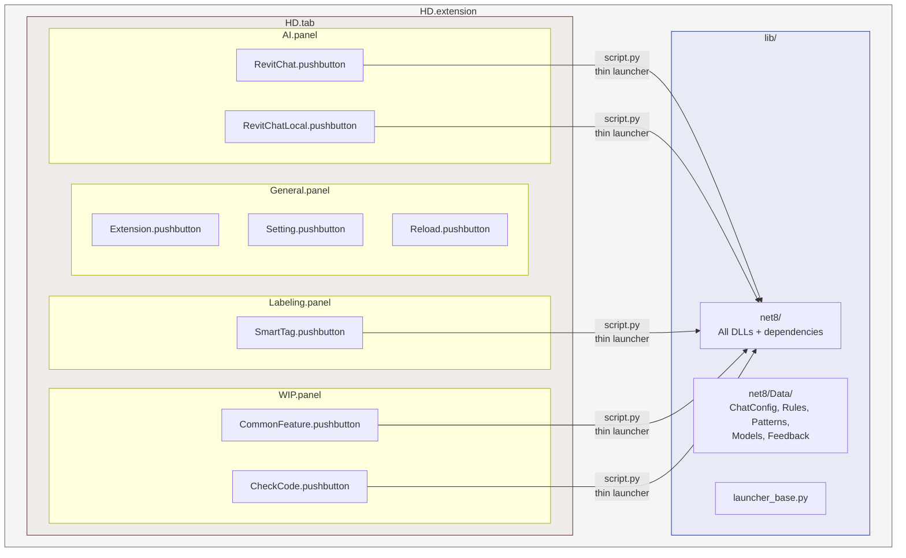
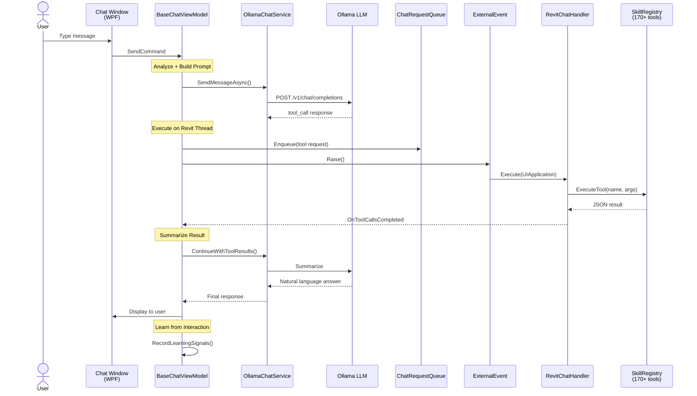
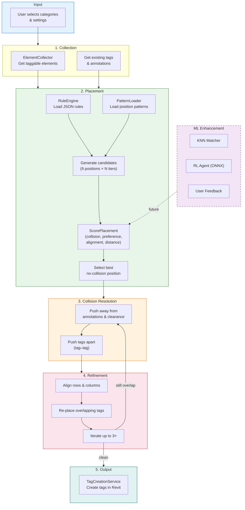
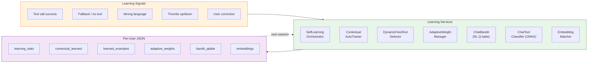
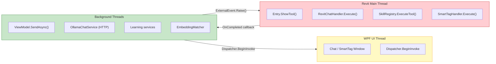
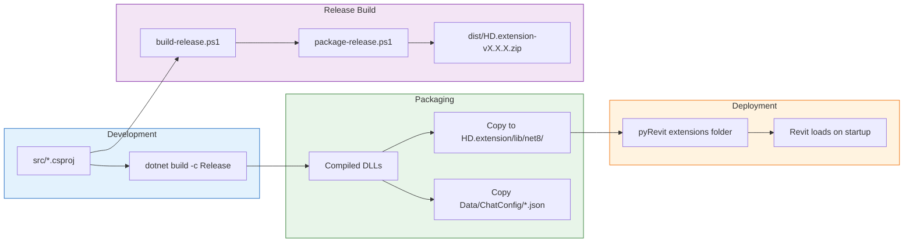

# HD Extension for Revit

A comprehensive pyRevit extension with C# DLL backend for Revit 2025+, featuring AI-powered chatbot, smart auto-tagging, and BIM utilities.

---

## High-Level Architecture



---

## Project & DLL Dependency Map



---

## pyRevit Extension Layout



---

## RevitChat — AI Chatbot Flow



---

## SmartTag — Tag Placement Pipeline



---

## Self-Learning System



---

## Threading Model



**Invariant rules:**
- ViewModel **never** calls Revit API directly
- Only `ExternalEvent` handlers may call Revit API (on main thread)
- AI/HTTP calls run on background threads, **never** inside ExternalEvent handlers

---

## Build & Deploy Flow



---

## Full Project Structure

```
RevitCode/
├── src/                                # Source code (PRIVATE)
│   ├── HD.Core/                        # Shared library (helpers, services)
│   ├── RevitChat/                      # AI chatbot — skills, handler, learning
│   │   ├── Skills/                     # 27 skill classes, 170+ tools
│   │   │   ├── SkillRegistry.cs        # Tool registration & routing
│   │   │   ├── QuerySkill.cs           # get_elements, count, search
│   │   │   ├── ModifySkill.cs          # set_parameter, delete, move
│   │   │   ├── ExportSkill.cs          # CSV, JSON, PDF, IFC export
│   │   │   ├── ViewControlSkill.cs     # hide, isolate, color override
│   │   │   ├── MepSystemAnalysisSkill  # duct/pipe summary, pressure
│   │   │   ├── MepConnectivitySkill    # auto-connect, traverse network
│   │   │   ├── ClashDetectionSkill     # spatial clash checks
│   │   │   └── ... (20+ more)
│   │   ├── Handler/
│   │   │   └── RevitChatHandler.cs     # IExternalEventHandler
│   │   ├── Services/
│   │   │   ├── PromptAnalyzer.cs       # Intent/entity extraction
│   │   │   ├── ToolExecutionService.cs # Queue → ExternalEvent → Result
│   │   │   ├── SelfLearningOrchestrator.cs
│   │   │   ├── ContextualAutoTrainer.cs
│   │   │   ├── ChatBandit.cs           # RL (Q-learning)
│   │   │   ├── ChatToolClassifier.cs   # ANN (ONNX)
│   │   │   ├── EmbeddingMatcher.cs     # Semantic matching
│   │   │   └── ...
│   │   ├── Models/
│   │   └── ViewModel/
│   │       └── BaseChatViewModel.cs    # Core chat flow
│   │
│   ├── RevitChatLocal/                 # Local Ollama variant
│   │   ├── Services/
│   │   │   └── OllamaChatService.cs    # HTTP to Ollama + smart routing
│   │   ├── UI/
│   │   │   └── LocalChatWindow.xaml    # WPF chat window
│   │   └── ViewModel/
│   │       └── LocalChatViewModel.cs
│   │
│   ├── SmartTag/                       # AI auto-tagging tool
│   │   ├── Services/
│   │   │   ├── TagPlacementService.cs  # Scoring + collision avoidance
│   │   │   ├── RuleEngine.cs           # JSON rule loading
│   │   │   └── SpatialIndex.cs         # Grid-based collision queries
│   │   ├── ML/
│   │   │   ├── RLAgent.cs              # ONNX RL inference
│   │   │   └── ContextAnalyzer.cs      # Element context extraction
│   │   └── Data/                       # Rules, patterns, training data
│   │
│   ├── CommonFeature/                  # BIM utility tools
│   └── CheckCode/                      # Model quality checks
│
├── HD.extension/                       # pyRevit extension (runtime)
│   ├── lib/
│   │   ├── net8/                       # All compiled DLLs + dependencies
│   │   │   └── Data/
│   │   │       ├── ChatConfig/         # keyword_groups, fewshot_examples,
│   │   │       │                       # chat_normalization, tool_schema_hints
│   │   │       ├── Rules/Tagging/      # Tag placement rules (JSON)
│   │   │       ├── Patterns/           # Tag position patterns
│   │   │       ├── Models/             # ONNX classifiers, RL checkpoints
│   │   │       └── Feedback/           # Per-user learned data
│   │   └── launcher_base.py            # Shared Python launcher
│   └── HD.tab/
│       ├── AI.panel/                   # RevitChat, RevitChatLocal
│       ├── Labeling.panel/             # SmartTag
│       ├── General.panel/              # Extension, Settings, Reload
│       └── WIP.panel/                  # CommonFeature, CheckCode
│
├── docs/                               # Architecture & design docs
│   ├── RevitChat-Architecture.md       # Full chat system documentation
│   ├── MCP-ARCHITECTURE-PLAN.md        # MCP Server integration plan
│   ├── UPGRADE-ROADMAP.md              # 95-item feature roadmap
│   └── ...
│
├── build-release.ps1                   # Build without PDB
└── package-release.ps1                 # Create distribution ZIP
```

---

## Development

### Prerequisites
- .NET SDK 8.0+
- Revit 2025 or 2026
- pyRevit 4.8+
- Ollama (for local AI chat — `qwen2.5:7b` recommended)

### Build Commands

```powershell
# Build all projects for development
dotnet build src/HD.Core/HD.Core.csproj -c Release
dotnet build src/RevitChat/RevitChat.csproj -c Release
dotnet build src/RevitChatLocal/RevitChatLocal.csproj -c Release
dotnet build src/SmartTag/SmartTag.csproj -c Release
dotnet build src/CommonFeature/CommonFeature.csproj -c Release

# Build release (no PDB) and package
.\build-release.ps1 -Version "2.1.0" -Clean
.\package-release.ps1 -Version "2.1.0"
```

### Adding New Tools (Skills)

1. Create a new class implementing `IRevitSkill` in `src/RevitChat/Skills/`
2. Register in `SkillRegistry.CreateDefault()`
3. Build — the tool is automatically available in both Chat UI and future MCP

### Adding New pyRevit Buttons

1. Create pushbutton folder in `HD.extension/HD.tab/<Panel>.panel/`
2. Use `launcher_base.py` for the thin launcher script:

```python
from launcher_base import launch_dll
launch_dll(
    dll_name="YourTool.dll",
    namespace="YourTool",
    method="Run"
)
```

---

## Distribution

### For Users
1. Download the ZIP from `dist/` folder
2. Extract to: `%APPDATA%\pyRevit-Master\extensions\`
3. Reload pyRevit

### What's Included in Release
- Compiled DLLs only (no source code, no debug symbols)
- Python launcher scripts
- JSON config files (ChatConfig, Rules, Patterns)
- Icons

### What's NOT Included
- C# source code (.cs files)
- Debug symbols (.pdb files)
- Development files

---

## Documentation

| Document | Description |
|----------|-------------|
| [RevitChat Architecture](docs/RevitChat-Architecture.md) | Full AI chatbot system with Mermaid diagrams |
| [MCP Architecture Plan](docs/MCP-ARCHITECTURE-PLAN.md) | Model Context Protocol integration |
| [Upgrade Roadmap](docs/UPGRADE-ROADMAP.md) | 95-item feature roadmap (8 phases) |
| [Release Notes v2.1.0](docs/RELEASE-NOTES-v2.1.0.md) | Latest release changelog |
| [Code Optimization](docs/code-optimization-proposals.md) | Refactoring proposals & results |
| [Test Prompts](docs/TEST-PROMPTS-REVIT.md) | Chatbot test suite (EN/VN/mixed) |

---

## License

Proprietary — All rights reserved
