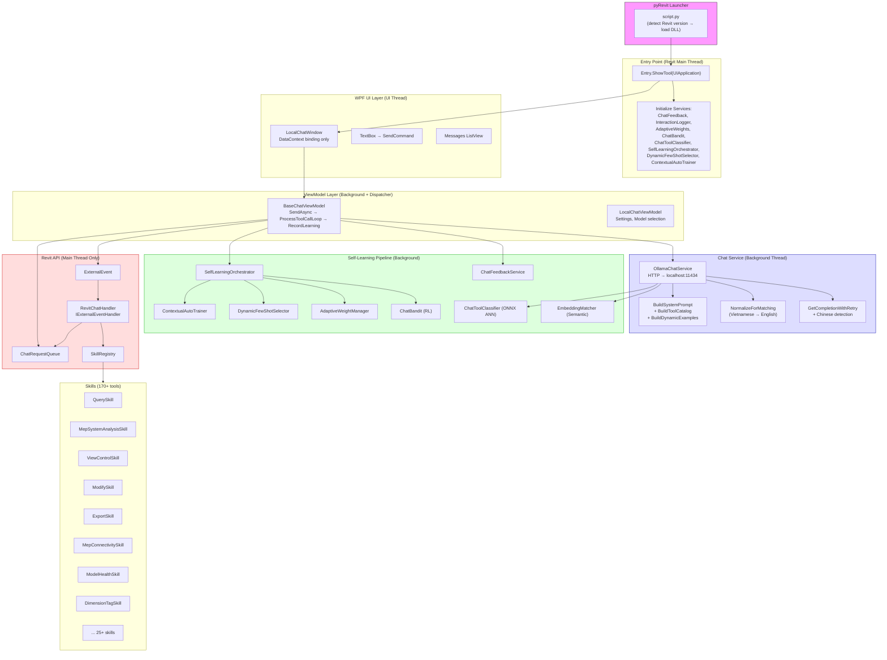
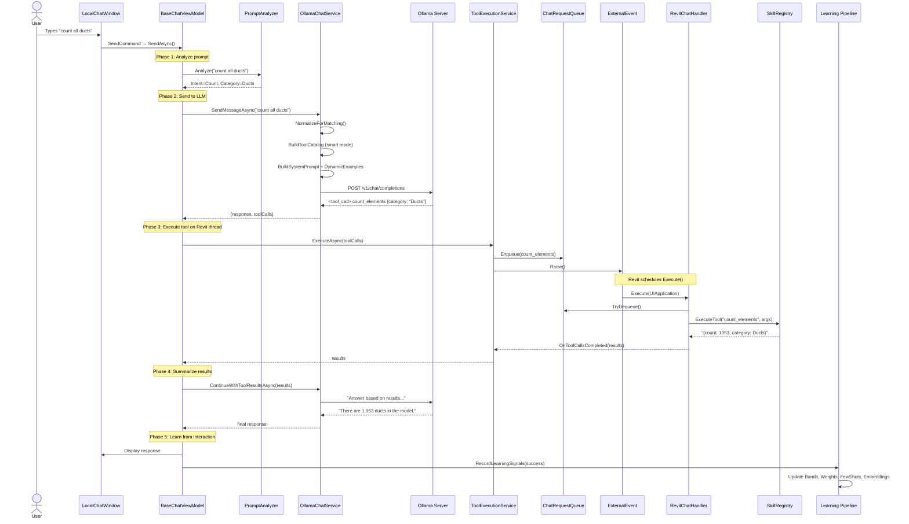
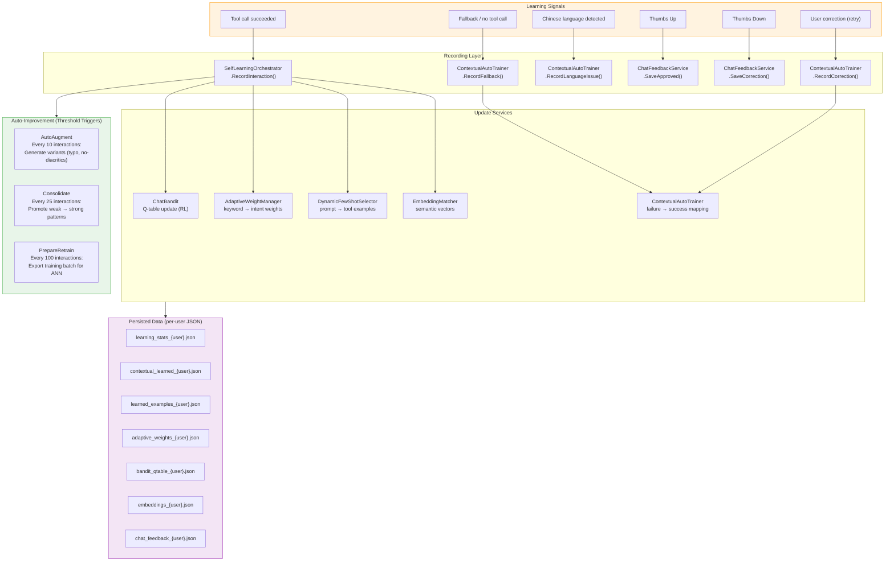
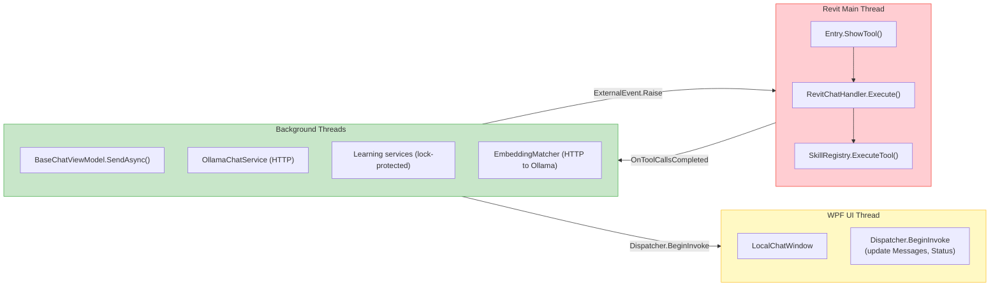
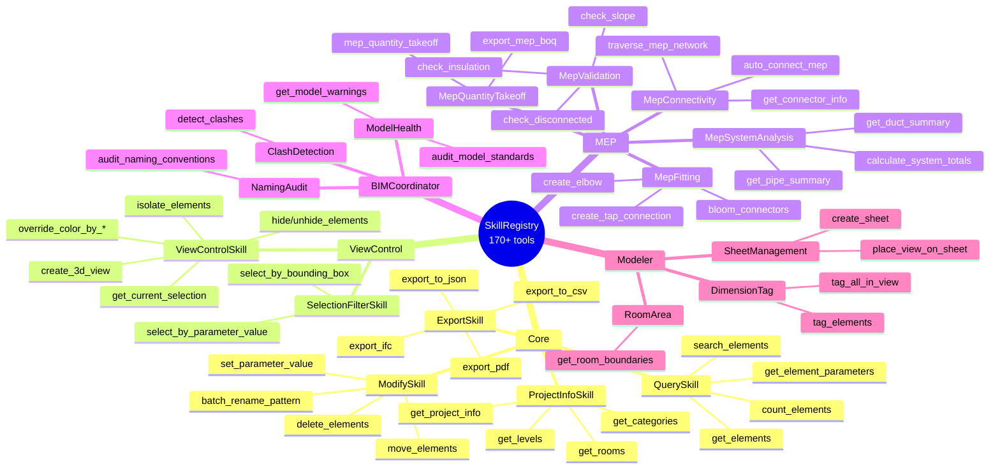
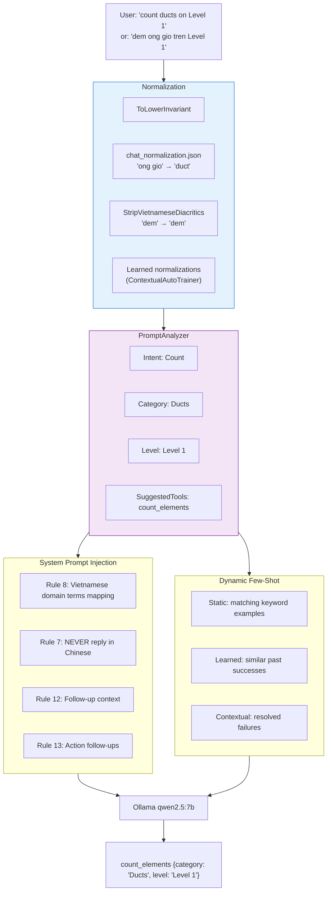

# RevitChat Architecture

## Overview

RevitChat is an AI chatbot integrated into Autodesk Revit, allowing users to query and manipulate BIM models through 170+ tools using Vietnamese, English, or mixed-language prompts. The system ships in two variants:

| | RevitChat | RevitChatLocal |
|---|---|---|
| Chat backend | OpenAI (cloud) | Ollama (local, qwen2.5:7b) |
| Window | `RevitChatWindow` | `LocalChatWindow` |
| ViewModel | `RevitChatViewModel` | `LocalChatViewModel` |
| Shared | Handler, Queue, Skills, Learning, BaseChatViewModel | same |

---

## High-Level Architecture



---

## Main Message Flow



---

## Smart Tool Selection Pipeline

```mermaid
flowchart LR
    subgraph Input
        MSG["User Message<br/>'classify by size'"]
        PREV["Previous Message<br/>'count ducts'"]
    end

    subgraph Normalize
        NORM["NormalizeForMatching<br/>chat_normalization.json<br/>+ StripDiacritics<br/>+ Learned normalizations"]
    end

    subgraph Selection["Tool Selection (6 sources)"]
        CORE["1. Core Tools<br/>(always included)"]
        KW["2. Keyword Groups<br/>keyword_groups.json"]
        PA["3. PromptAnalyzer<br/>SuggestedTools"]
        ANN["4. ANN Classifier<br/>tool_classifier.onnx"]
        FUP["5. Follow-up Patterns<br/>ContextualAutoTrainer"]
        EMB["6. Embedding Recs<br/>EmbeddingMatcher"]
    end

    subgraph Catalog["Tool Catalog"]
        TOP["Top 25 tools<br/>(15 for CPU mode)"]
    end

    subgraph Examples["Few-Shot Examples (4 sources)"]
        STATIC["1. fewshot_examples.json"]
        APPROVED["2. ChatFeedbackService<br/>approved examples"]
        DYNAMIC["3. DynamicFewShotSelector<br/>learned from success"]
        CONTEXT["4. ContextualAutoTrainer<br/>from resolved failures"]
    end

    subgraph Prompt["System Prompt"]
        SYS["Rules + Domain terms<br/>+ Tool catalog<br/>+ Examples<br/>+ Context hints"]
    end

    MSG --> NORM
    PREV --> NORM
    NORM --> Selection
    Selection --> TOP
    MSG --> Examples
    TOP --> SYS
    Examples --> SYS
    SYS --> LLM["→ Ollama LLM"]

    style Selection fill:#e8f4fd,stroke:#2196F3
    style Examples fill:#e8fde8,stroke:#4CAF50
```



---

## Self-Learning Pipeline



---

## Thread Model



**Invariant rules:**
- ViewModel **NEVER** calls Revit API directly
- Only `RevitChatHandler.Execute()` may call Revit API
- All Revit actions go through: `Request → Queue → ExternalEvent.Raise() → Handler`
- AI/HTTP calls run on background threads, **NEVER** inside ExternalEvent handler

---

## Skill Packs & Tools



---

## Bilingual Processing Flow



---

## File Structure

```
src/
├── RevitChat/                          # Shared library (DLL)
│   ├── Entry.cs                        # Entry point (OpenAI version)
│   ├── Handler/
│   │   └── RevitChatHandler.cs         # IExternalEventHandler (Revit thread)
│   ├── Models/
│   │   ├── IChatService.cs             # Chat service interface
│   │   ├── ChatMessage.cs              # UI message model
│   │   ├── ToolCallRequest.cs          # Tool call DTO
│   │   └── WorkingMemory.cs            # Session memory
│   ├── Services/
│   │   ├── PromptAnalyzer.cs           # Intent/entity extraction
│   │   ├── ToolExecutionService.cs     # Queue → ExternalEvent → Results
│   │   ├── ChatFeedbackService.cs      # Thumbs up/down persistence
│   │   ├── AdaptiveWeightManager.cs    # Keyword weight learning
│   │   ├── ChatBandit.cs               # RL tool selection (Q-learning)
│   │   ├── ChatToolClassifier.cs       # ONNX ANN classifier
│   │   ├── EmbeddingMatcher.cs         # Semantic embedding matching
│   │   ├── DynamicFewShotSelector.cs   # Learned few-shot examples
│   │   ├── SelfLearningOrchestrator.cs # Meta-learning coordinator
│   │   ├── ContextualAutoTrainer.cs    # Failure/follow-up learning
│   │   ├── InteractionLogger.cs        # Raw interaction logging
│   │   └── SelfTrainingService.cs      # Offline training data export
│   ├── Skills/                         # 25+ skill classes, 170+ tools
│   │   ├── SkillRegistry.cs            # Tool registration & routing
│   │   ├── QuerySkill.cs
│   │   ├── MepSystemAnalysisSkill.cs
│   │   ├── ViewControlSkill.cs
│   │   └── ...
│   └── ViewModel/
│       └── BaseChatViewModel.cs        # Core send/process/learn flow
│
├── RevitChatLocal/                     # Local Ollama variant (DLL)
│   ├── Entry.cs                        # Entry point (Ollama version)
│   ├── Services/
│   │   └── OllamaChatService.cs        # Ollama HTTP client + smart routing
│   ├── UI/
│   │   ├── LocalChatWindow.xaml        # WPF chat UI
│   │   └── LocalChatWindow.xaml.cs     # Code-behind (binding only)
│   └── ViewModel/
│       └── LocalChatViewModel.cs       # Settings, model selection
│
HD.extension/lib/net8/
├── Data/
│   ├── ChatConfig/
│   │   ├── keyword_groups.json         # Keyword → tool group mapping
│   │   ├── fewshot_examples.json       # Static few-shot examples
│   │   ├── chat_normalization.json     # Vietnamese → English normalization
│   │   └── tool_schema_hints.json      # Compact tool signatures
│   ├── Feedback/                       # Per-user learned data
│   │   ├── contextual_learned_{user}.json
│   │   ├── learned_examples_{user}.json
│   │   ├── adaptive_weights_{user}.json
│   │   ├── bandit_qtable_{user}.json
│   │   └── embeddings_{user}.json
│   └── Models/
│       ├── tool_classifier.onnx        # ANN tool classifier
│       └── tool_classifier_index.json  # Tool name ↔ index mapping
```
