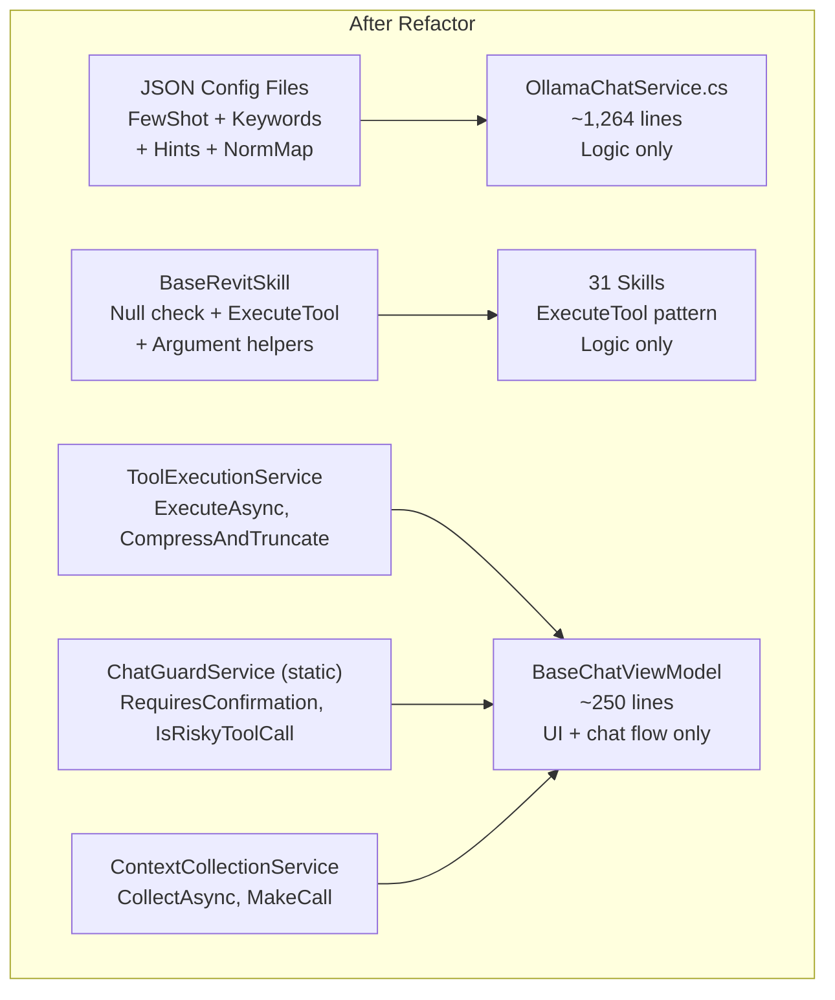

# Code Optimization and Organization Proposals

## Implementation Status

| Phase | Item | Status |
|-------|------|--------|
| **D1** | Extract static data to JSON | Completed |
| **D2** | BaseRevitSkill + ExecuteTool pattern | Completed |
| **D3** | Extract BaseChatViewModel (ToolExecutionService, ChatGuardService, ContextCollectionService) | Completed |
| **E1** | Streaming LLM response | Completed |
| **E2** | Reduce tool catalog (max 40 tools) | Completed |
| **E3** | Token-aware history trimming | Completed |
| **E4** | Cache Few-Shot scoring | Completed |
| **F1** | Required parameter validation + retry | Completed |
| **F2** | Levenshtein fuzzy match | Completed |
| **F3** | Retry on malformed JSON | Completed |
| **F4** | Weighted keyword scoring | Completed |
| **F5** | Disambiguation rules in system prompt | Completed |

---

## Current State


**Main issues:**

- `OllamaChatService.cs`: 2,199 lines, 47% hardcoded data (FewShot, Keywords, Hints)
- 31 skills with repeated boilerplate: null check, transaction, element resolution (58 transaction blocks)
- `BaseChatViewModel`: 623 lines, 14 responsibilities (chat flow + tool exec + context + memory + UI + feedback + risk + cancel + settings + diagnostics)
- `TruncateToolResults` (lines 315–331) removed — `CompressAndTruncate` now in ToolExecutionService
- All tool config hardcoded in C# — adding/editing tools requires rebuild

---

## Proposal A: Extract Static Data to JSON Config

**Scope:** OllamaChatService.cs only

**What:**

- Extract `FewShotExamples` (228 entries) to `fewshot_examples.json`
- Extract `KeywordGroups` (33 groups) to `keyword_groups.json`
- Extract `ToolSchemaHints` (174 entries) to `tool_schema_hints.json`
- Extract `NormalizationMap`, `ActionKeywords`, `ChitchatPatterns` to `chat_config.json`
- Load all from JSON at service initialization

**Pros:**

- OllamaChatService reduced by ~1,038 lines (47%) → ~1,161 lines of pure logic
- Adding/editing FewShot, Keywords without rebuilding DLL
- Non-developers (Digital Leads) can edit JSON directly
- JSON can be deployed separately, hot-reloaded if needed
- Low risk — only moving data, logic unchanged

**Cons:**

- Need validation when loading JSON (schema error = crash)
- Loss of compile-time type safety for data
- Must maintain JSON schema documentation
- Deployment slightly more complex (DLL + JSON files)

**Effort:** Low-Medium (~2-3 hours)

---

## Proposal B: Base Skill Class + Transaction Helper

**Scope:** 31 skill files

**What:**

- Create `BaseRevitSkill` abstract class:
  - `Execute(string functionName, UIApplication app, Dictionary<string, object> args)` wrapper with auto null check + routing
  - `RunInTransaction(doc, name, action)` helper with auto try/catch/rollback (exists but not yet migrated for all 58 transaction blocks)
  - Argument helpers: `GetString`, `GetInt`, `GetDouble`, `GetBool`, `GetElementIds`, `GetStringList`
  - `UnknownTool(tool)` uses `SkillName` (not `Name`)
- Each skill only overrides `ExecuteTool(string tool, UIDocument uidoc, Document doc, Dictionary<string, object> args)`
- Eliminates repeated boilerplate across 31 skills — **all 31 skills migrated to ExecuteTool pattern**

> **Note:** Actual signature uses `UIApplication` + `Dictionary<string, object>`, NOT `UIDocument` + `JsonElement`.
> `UIDocument` is obtained via `app.ActiveUIDocument` inside `Execute()`.

**Before:**

```csharp
public string Execute(string functionName, UIApplication app, Dictionary<string, object> args)
{
    var uidoc = app.ActiveUIDocument;
    if (uidoc == null) return JsonError("No active document.");
    var doc = uidoc.Document;
    return functionName switch
    {
        "tool_a" => DoToolA(doc, args),
        _ => JsonError($"MySkill: unknown tool '{functionName}'")
    };
}

private string DoToolA(Document doc, Dictionary<string, object> args)
{
    using var trans = new Transaction(doc, "AI: Tool A");
    try
    {
        trans.Start();
        // ... logic ...
        trans.Commit();
        return result;
    }
    catch (Exception ex)
    {
        if (trans.GetStatus() == TransactionStatus.Started) trans.RollBack();
        return JsonError($"Tool A failed: {ex.Message}");
    }
}
```

**After:**

```csharp
protected override string ExecuteTool(
    string tool, UIDocument uidoc, Document doc,
    Dictionary<string, object> args)
{
    return tool switch
    {
        "tool_a" => DoToolA(doc, args),
        _ => UnknownTool(tool)
    };
}

private string DoToolA(Document doc, Dictionary<string, object> args)
{
    return RunInTransaction(doc, "Tool A", () =>
    {
        // logic only — no try/catch/rollback needed
        return result;
    });
}
```

**Pros:**

- Eliminates ~15-20 boilerplate lines per skill (x31 files = ~465-620 lines)
- Consistent transaction handling — no missed rollbacks
- Null checks never forgotten
- Easy to add cross-cutting concerns (logging, timing, etc.)

**Cons:**

- Refactoring 31 files = higher regression risk
- Each skill needs thorough testing after refactor
- Inheritance can be complex if skills need custom behavior
- Does not reduce logic code — only reduces boilerplate

**Effort:** Medium (~4-6 hours)

---

## Proposal C: Extract BaseChatViewModel

**Scope:** BaseChatViewModel.cs + related

**What:**

- Extract `ToolExecutionService` — contains `ExecuteToolCallsAsync`, timeout, `TaskCompletionSource`
- Extract `ChatGuardService` (static) — contains `IsRiskyToolCall`, `RequiresConfirmation`, `IsConfirmMessage`, `IsCancelMessage`
- Extract `ContextCollectionService` — contains `CollectAsync`, keyword-based context selection
- Split `SendAsync` (~186 lines, lines 102–287) into:
  - `HandleConfirmationFlow()`
  - `ExecuteToolLoop()`
  - `ProcessToolResults()`

**Pros:**

- Single Responsibility — each class does one thing
- Easy to test each service independently
- `SendAsync` becomes more readable
- Paves the way for dependency injection

**Cons:**

- Increases file/class count
- Need to wire dependencies (constructor injection)
- Regression risk on the main flow (chat loop)
- Minimal benefit if unit tests are not written

**Effort:** Medium (~3-4 hours)

---

## Proposal D: Full Refactor (A + B + C) — Details

**Scope:** All of RevitChat + RevitChatLocal



---

### D1. Extract Static Data to JSON (= Proposal A) — Completed

**OllamaChatService.cs before — 2,199 lines:**

| Section | Line Range | Lines | Type |
|---------|-----------|-------|------|
| CoreTools (24 tool names) | 45–53 | 9 | Data |
| KeywordGroups (33 groups) | 56–258 | 203 | Data |
| NormalizationMap (25 entries) | 260–286 | 27 | Data |
| ActionKeywords (75 entries) | 288–300 | 13 | Data |
| ToolSchemaHints (174 entries) | 302–526 | 225 | Data |
| FewShotExamples (228 entries) | 532–1084 | 553 | Data |
| ChitchatPatterns (21 entries) | 1251–1258 | 8 | Data |
| **Total data** | | **~1,038** | **47.2%** |
| **Logic (methods)** | | **~1,161** | **52.8%** |

**Extracted to 4 JSON files:**

```
HD.extension/lib/net8/Data/ChatConfig/
├── fewshot_examples.json      (228 entries)
├── keyword_groups.json        (33 groups + CoreTools + ActionKeywords)
├── tool_schema_hints.json     (174 entries)
└── chat_normalization.json    (NormMap + ChitchatPatterns)
```

**Result:** OllamaChatService reduced from 2,199 → ~1,161 lines.

---

### D2. BaseRevitSkill + ExecuteTool Pattern (= Proposal B) — Completed

**Before: Boilerplate repeated in 31 skills.**

Execute() wrapper appeared in **31/31 skill files** (before refactor).
Transaction pattern appeared **58 times** across 31 files.

**BaseRevitSkill.cs created (new).**

> **Implementation note:** 31 skills migrated to ExecuteTool pattern. Transaction blocks still use manual `using(var trans = new Transaction(...))` — `RunInTransaction` is available in BaseRevitSkill but not yet migrated for all 58 blocks.

**Impact across 31 files:**
- 31 skills migrated to ExecuteTool pattern
- 58 transaction blocks: `RunInTransaction` available but not yet migrated — skills still use manual transaction handling
- 31 Execute() wrappers reduced by 5-7 lines each → ~155-217 lines saved

**Refactoring order (by risk, based on actual transaction count):**
1. Skills with no transactions (0 risk) — **16 files**
2. Skills with 1-3 transactions (low risk) — **12 files**
3. Skills with 5+ transactions (medium-high risk) — **4 files**: MepModelerSkill(5), GridLevelSkill(5), ModifySkill(8), ViewControlSkill(18)

---

### D3. Extract BaseChatViewModel (= Proposal C) — Completed

**Before: BaseChatViewModel.cs — 623 lines, 14 responsibilities.**

**Extracted to:**

- **ToolExecutionService** (concrete class, NO interface): `ExecuteAsync`, `UpdateMemory`, `CompressAndTruncate` (static), `CancelPending`, `Cleanup`
- **ChatGuardService** (STATIC class, NOT ConfirmationPolicy): `IsEchoResponse`, `IsConfirmMessage`, `IsCancelMessage`, `RequiresConfirmation`, `IsRiskyToolCall`, `GetTotalChars`
- **ContextCollectionService** (concrete class, NO interface, NOT ContextCollector): `CollectAsync`, `MakeCall`

> **Note:** No separate `ResultCompressor` class — `CompressAndTruncate` is a static method on ToolExecutionService. BaseChatViewModel uses constructor injection (not interface-based DI).

---

### D5. Actual Results

| Metric | Before | After | Change |
|--------|--------|-------|--------|
| OllamaChatService.cs | 2,199 lines | ~1,161 lines | **-47%** |
| BaseChatViewModel.cs | 623 lines | ~250 lines | **-60%** |
| Skills migrated to ExecuteTool | 0 | 31 | **31/31** |
| Transaction blocks migrated to RunInTransaction | 0 | 0 | 58 blocks still manual |
| Dead code removed | TruncateToolResults | Removed | Clean |
| Services extracted | — | ToolExecutionService, ChatGuardService, ContextCollectionService | — |
| External config files | 1 (ollama_config) | 5 | +4 |
| Streaming | Blocking | StreamCompletionAsync + TokenReceived | Done |
| Tool catalog limit | 30-80 | 40 (maxToolsInCatalog) | Done |
| Token budget | — | config.MaxTokens * 3 | Done |

---

## Proposal E: Speed Optimization

### E1. Streaming LLM Response (Highest Impact) — Completed

`StreamCompletionAsync` + `TokenReceived` event → tokens appear immediately.

- **Perceived latency:** Reduced from ~5s → ~0.3s (first token)

### E2. Reduce Tool Catalog Size — Completed

Tool catalog limited to `maxToolsInCatalog = 40` tools.

### E3. Token-Aware History Trimming — Completed

Token budget = `config.MaxTokens * 3`, `EstimateTokens` uses `text.Length / 3`.

### E4. Cache Few-Shot Scoring — Completed

Pre-compiled regex cache (`_regexCache`) with `RegexOptions.Compiled`, LRU-style dictionary cache (`_fewShotCache`, max 32 entries).

---

## Proposal F: Accuracy Optimization

### F1. Required Parameter Validation + Retry — Completed

`ValidateToolCalls` + `RetryWithValidationErrorAsync` on IChatService.

**Impact:** ~80% reduction in missing parameter errors.

### F2. Improved Fuzzy Match (Levenshtein) — Completed

Levenshtein distance in `FuzzyMatchToolName`.

**Impact:** ~90% reduction in false matches.

### F3. Retry on Malformed JSON — Completed

Retry integrated in streaming flow.

**Impact:** ~70% reduction in silent failures.

### F4. Weighted Keyword Scoring — Completed

Multi-keyword bonus + character-length bonus in `GetMatchedGroups`.

**Impact:** ~30% improvement in FewShot selection accuracy.

### F5. System Prompt Disambiguation Rule — Completed

Disambiguation rules added to `BuildSystemPrompt`.

**Impact:** ~40% reduction in wrong tool selection.

---

## Overall Comparison

| Criteria | A (JSON) | B (BaseRevitSkill) | C (ViewModel) | D (Full) |
|----------|----------|-------------------|---------------|----------|
| Impact | OllamaChatService -47% | 31 skills ExecuteTool pattern | ViewModel 623→250 lines | All |
| Status | Completed | Completed | Completed | Completed |
| Risk | Low | Medium | Medium | High |
| Effort | 2-3h | 4-6h | 3-4h | 9-13h |
| Immediate ROI | High (edit JSON) | Medium | Low | High (long-term) |

**All proposals A, B, C, D, E, F have been implemented.**
