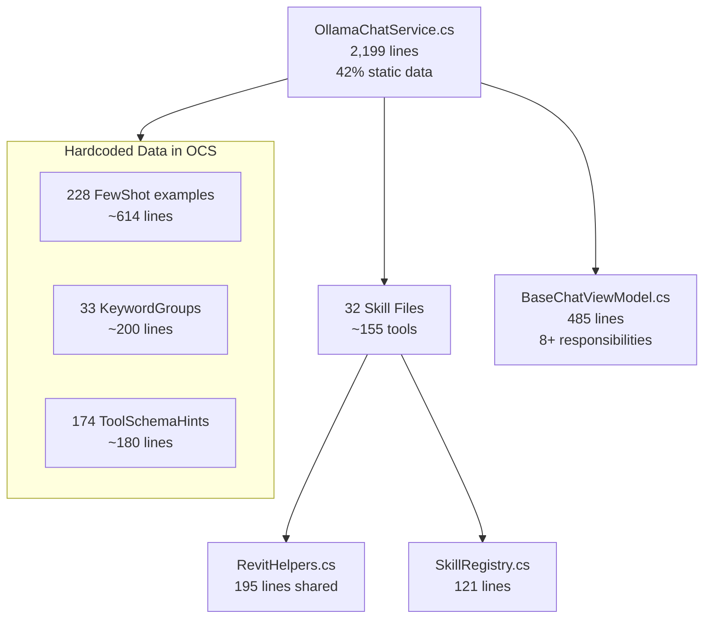
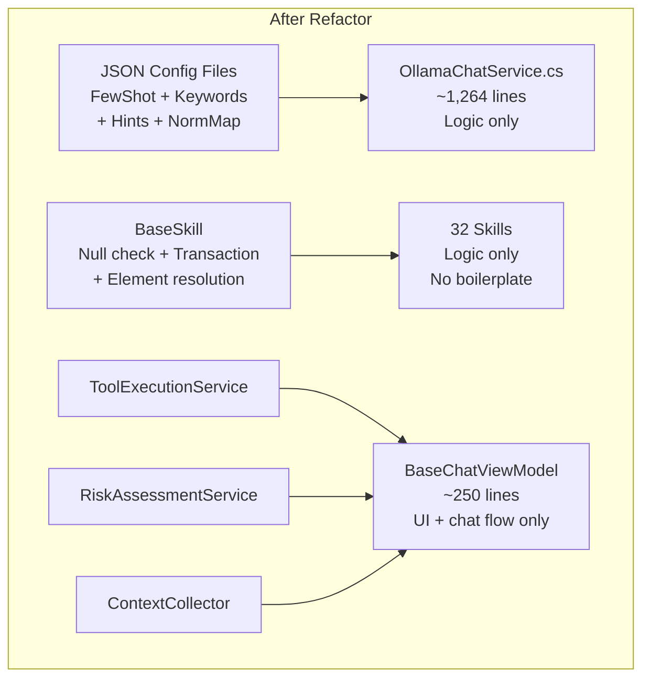

# Phương Án Tối Ưu Code Và Tổ Chức

## Hiện Trạng



**Vấn đề chính:**

- `OllamaChatService.cs`: 2,199 dòng, 42% là data cứng (FewShot, Keywords, Hints)
- 32 skills lặp boilerplate: null check, transaction, element resolution
- `BaseChatViewModel`: quá nhiều trách nhiệm (chat flow + tool exec + context + memory + UI + feedback + risk)
- Mọi config tool đều hardcoded trong C# — thêm/sửa tool phải rebuild

---

## Phương Án A: Tách Static Data Ra JSON Config

**Scope:** OllamaChatService.cs only

**Làm gì:**

- Tách `FewShotExamples` (228 entries) ra `fewshot_examples.json`
- Tách `KeywordGroups` (33 groups) ra `keyword_groups.json`
- Tách `ToolSchemaHints` (174 entries) ra `tool_schema_hints.json`
- Tách `NormalizationMap`, `ActionKeywords`, `ChitchatPatterns` ra `chat_config.json`
- Load tất cả từ JSON khi khởi tạo service

**Ưu điểm:**

- OllamaChatService giảm ~935 dòng (42%) -> ~1,264 dòng logic thuần
- Thêm/sửa FewShot, Keywords không cần rebuild DLL
- Non-developer (Digital Lead) có thể edit JSON trực tiếp
- Có thể deploy JSON riêng, hot-reload khi cần
- Risk thấp — chỉ di chuyển data, logic không đổi

**Nhược điểm:**

- Cần validation khi load JSON (schema lỗi = crash)
- Mất compile-time type safety cho data
- Phải maintain JSON schema documentation
- Deployment phức tạp hơn chút (DLL + JSON files)

**Effort:** Thấp-Trung bình (~2-3 giờ)

---

## Phương Án B: Base Skill Class + Transaction Helper

**Scope:** 32 skill files

**Làm gì:**

- Tạo `BaseSkill` abstract class:
  - `Execute()` wrapper tự check `uidoc` null + route tool
  - `ExecuteInTransaction(doc, name, action)` helper tự try/catch/rollback
  - `ResolveElements(doc, args)` helper tự parse + validate element IDs
  - `GetRequiredArg<T>()` tự throw nếu missing
- Mỗi skill chỉ cần override `ExecuteTool(string tool, UIDocument uidoc, JsonElement args)`
- Loại bỏ boilerplate lặp trong 32 files

**Before:**

```csharp
public string Execute(string functionName, UIDocument uidoc, JsonElement args)
{
    if (uidoc == null) return JsonError("No active document.");
    var doc = uidoc.Document;
    return functionName switch
    {
        "tool_a" => DoToolA(doc, args),
        _ => JsonError($"MySkill: unknown tool '{functionName}'")
    };
}

private string DoToolA(Document doc, JsonElement args)
{
    using var trans = new Transaction(doc, "AI: Tool A");
    try
    {
        trans.Start();
        // ... logic ...
        trans.Commit();
        return result;
    }
    catch (Exception ex)
    {
        if (trans.GetStatus() == TransactionStatus.Started) trans.RollBack();
        return JsonError($"Tool A failed: {ex.Message}");
    }
}
```

**After:**

```csharp
protected override string ExecuteTool(string tool, UIDocument uidoc, JsonElement args)
{
    return tool switch
    {
        "tool_a" => DoToolA(uidoc.Document, args),
        _ => UnknownTool(tool)
    };
}

private string DoToolA(Document doc, JsonElement args)
{
    return ExecuteInTransaction(doc, "Tool A", () =>
    {
        // ... logic only ...
        return result;
    });
}
```

**Ưu điểm:**

- Loại bỏ ~15-20 dòng boilerplate mỗi skill (x32 files = ~500-640 dòng)
- Transaction handling nhất quán — không sót rollback
- Null check không bao giờ quên
- Dễ thêm cross-cutting concerns (logging, timing, etc.)

**Nhược điểm:**

- Refactor 32 files = risk regression cao
- Cần test kỹ từng skill sau refactor
- Inheritance có thể phức tạp nếu skill cần custom behavior
- Không giảm được logic code — chỉ giảm boilerplate

**Effort:** Trung bình (~4-6 giờ)

---

## Phương Án C: Tách BaseChatViewModel

**Scope:** BaseChatViewModel.cs + liên quan

**Làm gì:**

- Extract `ToolExecutionService` — chứa `ExecuteToolCallsAsync`, timeout, `TaskCompletionSource`
- Extract `RiskAssessmentService` — chứa `IsRiskyToolCall`, `RequiresConfirmation`, hardcoded risky tools set
- Extract `ContextCollector` — chứa `CollectContextAsync`, keyword-based context selection
- Split `SendAsync` (~180 dòng) thành:
  - `HandleConfirmationFlow()`
  - `ExecuteToolLoop()`
  - `ProcessToolResults()`

**Ưu điểm:**

- Single Responsibility — mỗi class 1 việc
- Dễ test từng service riêng
- `SendAsync` dễ đọc hơn
- Mở đường cho dependency injection

**Nhược điểm:**

- Tăng số file/class
- Cần wire dependencies (constructor injection)
- Risk regression trên flow chính (chat loop)
- Benefit nhỏ nếu không viết unit test

**Effort:** Trung bình (~3-4 giờ)

---

## Phương Án D: Full Refactor (A + B + C)

**Scope:** Toàn bộ RevitChat + RevitChatLocal



**Ưu điểm:**

- Codebase sạch nhất, dễ maintain nhất
- Mỗi component có trách nhiệm rõ ràng
- Non-dev có thể edit FewShot/Keywords
- Dễ onboard developer mới

**Nhược điểm:**

- Effort lớn nhất
- Risk regression cao nhất — đụng nhiều file
- Cần Revit để test toàn bộ
- Nếu code đang chạy ổn, ROI có thể thấp

**Effort:** Cao (~8-12 giờ)

---

## So Sánh Tổng Quát

| Tiêu chí | A (JSON) | B (BaseSkill) | C (ViewModel) | D (Full) |
|----------|----------|---------------|----------------|----------|
| Impact | OllamaChatService -42% | 32 skills -boilerplate | ViewModel clean | All |
| Risk | Thấp | Trung bình | Trung bình | Cao |
| Effort | 2-3h | 4-6h | 3-4h | 8-12h |
| ROI ngay | Cao (edit JSON) | Trung bình | Thấp | Cao (long-term) |
| Priority | **1st** | **2nd** | 3rd | Combo |

**Đề xuất:** Bắt đầu với **A** (risk thấp, ROI cao nhất), sau đó **B** nếu cần.
