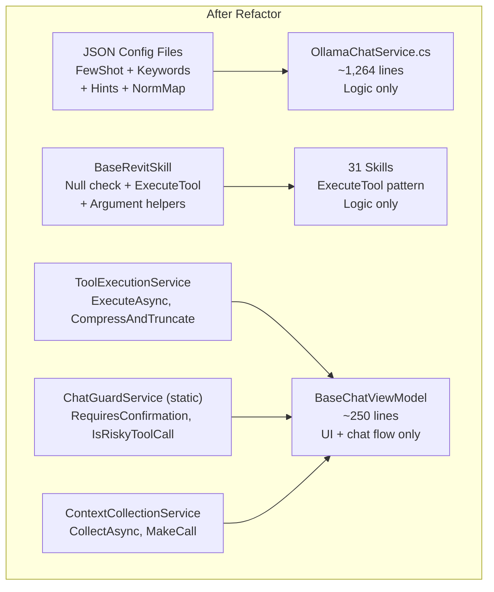
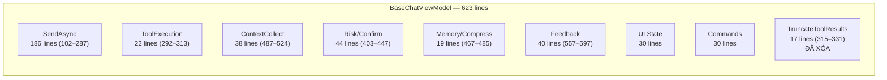
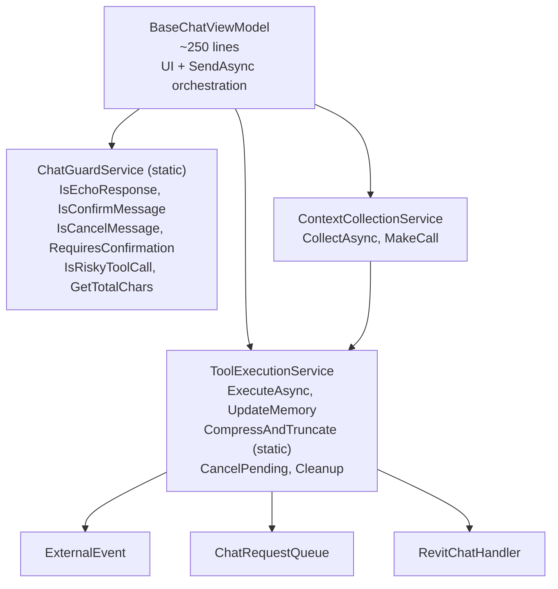
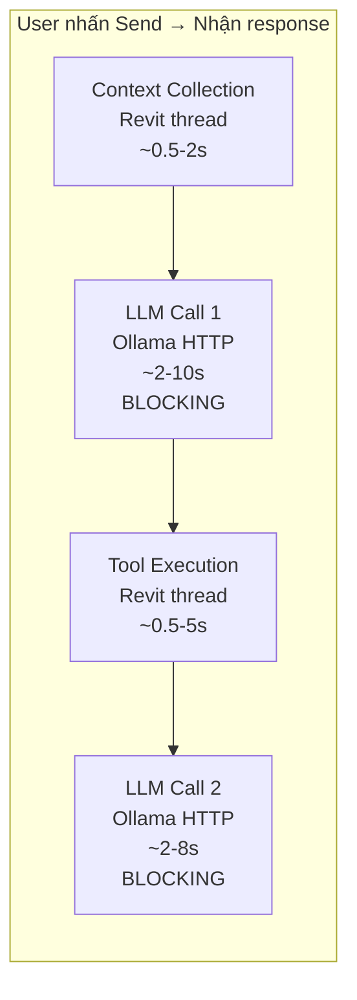
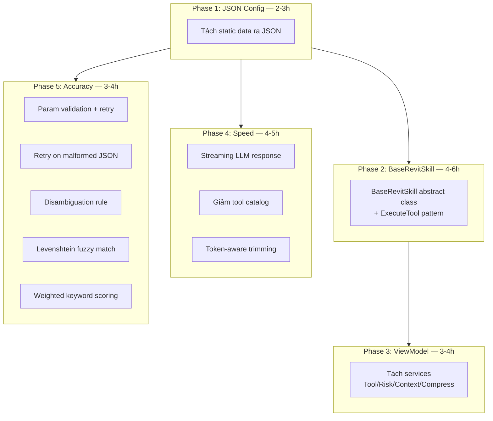

# Phương Án Tối Ưu Code Và Tổ Chức

## Trạng Thái Triển Khai

| Phase | Mục | Trạng thái |
|-------|-----|------------|
| **D1** | Tách static data ra JSON | ✅ Hoàn thành |
| **D2** | BaseRevitSkill + ExecuteTool pattern | ✅ Hoàn thành |
| **D3** | Tách BaseChatViewModel (ToolExecutionService, ChatGuardService, ContextCollectionService) | ✅ Hoàn thành |
| **E1** | Streaming LLM response | ✅ Hoàn thành |
| **E2** | Giảm tool catalog (max 40 tools) | ✅ Hoàn thành |
| **E3** | Token-aware history trimming | ✅ Hoàn thành |
| **E4** | Cache Few-Shot scoring | ✅ Hoàn thành |
| **F1** | Required parameter validation + retry | ✅ Hoàn thành |
| **F2** | Levenshtein fuzzy match | ✅ Hoàn thành |
| **F3** | Retry on malformed JSON | ✅ Hoàn thành |
| **F4** | Weighted keyword scoring | ✅ Hoàn thành |
| **F5** | Disambiguation rules trong system prompt | ✅ Hoàn thành |

---

## Hiện Trạng


**Vấn đề chính:**

- `OllamaChatService.cs`: 2,199 dòng, 47% là data cứng (FewShot, Keywords, Hints)
- 31 skills lặp boilerplate: null check, transaction, element resolution (58 transaction blocks)
- `BaseChatViewModel`: 623 dòng, 14 trách nhiệm (chat flow + tool exec + context + memory + UI + feedback + risk + cancel + settings + diagnostics)
- `TruncateToolResults` (lines 315–331) đã xóa — `CompressAndTruncate` trong ToolExecutionService
- Mọi config tool đều hardcoded trong C# — thêm/sửa tool phải rebuild

---

## Phương Án A: Tách Static Data Ra JSON Config

**Scope:** OllamaChatService.cs only

**Làm gì:**

- Tách `FewShotExamples` (228 entries) ra `fewshot_examples.json`
- Tách `KeywordGroups` (33 groups) ra `keyword_groups.json`
- Tách `ToolSchemaHints` (174 entries) ra `tool_schema_hints.json`
- Tách `NormalizationMap`, `ActionKeywords`, `ChitchatPatterns` ra `chat_config.json`
- Load tất cả từ JSON khi khởi tạo service

**Ưu điểm:**

- OllamaChatService giảm ~1,038 dòng (47%) -> ~1,161 dòng logic thuần
- Thêm/sửa FewShot, Keywords không cần rebuild DLL
- Non-developer (Digital Lead) có thể edit JSON trực tiếp
- Có thể deploy JSON riêng, hot-reload khi cần
- Risk thấp — chỉ di chuyển data, logic không đổi

**Nhược điểm:**

- Cần validation khi load JSON (schema lỗi = crash)
- Mất compile-time type safety cho data
- Phải maintain JSON schema documentation
- Deployment phức tạp hơn chút (DLL + JSON files)

**Effort:** Thấp-Trung bình (~2-3 giờ)

---

## Phương Án B: Base Skill Class + Transaction Helper

**Scope:** 31 skill files

**Làm gì:**

- Tạo `BaseRevitSkill` abstract class:
  - `Execute(string functionName, UIApplication app, Dictionary<string, object> args)` wrapper tự check `uidoc` null + route tool
  - `RunInTransaction(doc, name, action)` helper tự try/catch/rollback (có sẵn nhưng chưa migrate hết 58 transaction blocks)
  - Argument helpers: `GetString`, `GetInt`, `GetDouble`, `GetBool`, `GetElementIds`, `GetStringList`
  - `UnknownTool(tool)` dùng `SkillName` (không phải `Name`)
- Mỗi skill chỉ cần override `ExecuteTool(string tool, UIDocument uidoc, Document doc, Dictionary<string, object> args)`
- Loại bỏ boilerplate lặp trong 31 skills — **đã migrate 31 skills sang ExecuteTool pattern**

> **Lưu ý:** Signature thực tế dùng `UIApplication` + `Dictionary<string, object>`, KHÔNG phải `UIDocument` + `JsonElement`.
> `UIDocument` được lấy qua `app.ActiveUIDocument` bên trong `Execute()`.

**Before:**

```csharp
public string Execute(string functionName, UIApplication app, Dictionary<string, object> args)
{
    var uidoc = app.ActiveUIDocument;
    if (uidoc == null) return JsonError("No active document.");
    var doc = uidoc.Document;
    return functionName switch
    {
        "tool_a" => DoToolA(doc, args),
        _ => JsonError($"MySkill: unknown tool '{functionName}'")
    };
}

private string DoToolA(Document doc, Dictionary<string, object> args)
{
    using var trans = new Transaction(doc, "AI: Tool A");
    try
    {
        trans.Start();
        // ... logic ...
        trans.Commit();
        return result;
    }
    catch (Exception ex)
    {
        if (trans.GetStatus() == TransactionStatus.Started) trans.RollBack();
        return JsonError($"Tool A failed: {ex.Message}");
    }
}
```

**After:**

```csharp
protected override string ExecuteTool(
    string tool, UIDocument uidoc, Document doc,
    Dictionary<string, object> args)
{
    return tool switch
    {
        "tool_a" => DoToolA(doc, args),
        _ => UnknownTool(tool)
    };
}

private string DoToolA(Document doc, Dictionary<string, object> args)
{
    return RunInTransaction(doc, "Tool A", () =>
    {
        // ... logic only ...
        return result;
    });
}
```

**Ưu điểm:**

- Loại bỏ ~15-20 dòng boilerplate mỗi skill (x31 files = ~465-620 dòng)
- Transaction handling nhất quán — không sót rollback
- Null check không bao giờ quên
- Dễ thêm cross-cutting concerns (logging, timing, etc.)

**Nhược điểm:**

- Refactor 31 files = risk regression cao
- Cần test kỹ từng skill sau refactor
- Inheritance có thể phức tạp nếu skill cần custom behavior
- Không giảm được logic code — chỉ giảm boilerplate

**Effort:** Trung bình (~4-6 giờ)

---

## Phương Án C: Tách BaseChatViewModel

**Scope:** BaseChatViewModel.cs + liên quan

**Làm gì:**

- Extract `ToolExecutionService` — chứa `ExecuteToolCallsAsync`, timeout, `TaskCompletionSource`
- Extract `ChatGuardService` (static) — chứa `IsRiskyToolCall`, `RequiresConfirmation`, `IsConfirmMessage`, `IsCancelMessage`
- Extract `ContextCollectionService` — chứa `CollectAsync`, keyword-based context selection
- Split `SendAsync` (~186 dòng, lines 102–287) thành:
  - `HandleConfirmationFlow()`
  - `ExecuteToolLoop()`
  - `ProcessToolResults()`

**Ưu điểm:**

- Single Responsibility — mỗi class 1 việc
- Dễ test từng service riêng
- `SendAsync` dễ đọc hơn
- Mở đường cho dependency injection

**Nhược điểm:**

- Tăng số file/class
- Cần wire dependencies (constructor injection)
- Risk regression trên flow chính (chat loop)
- Benefit nhỏ nếu không viết unit test

**Effort:** Trung bình (~3-4 giờ)

---

## Phương Án D: Full Refactor (A + B + C) — Chi Tiết

**Scope:** Toàn bộ RevitChat + RevitChatLocal



---

### D1. Tách Static Data Ra JSON (= Phương Án A) ✅

**Hiện trạng OllamaChatService.cs — 2,199 dòng:**

| Section | Line Range | Lines | Type |
|---------|-----------|-------|------|
| CoreTools (24 tool names) | 45–53 | 9 | Data |
| KeywordGroups (33 groups) | 56–258 | 203 | Data |
| NormalizationMap (25 entries) | 260–286 | 27 | Data |
| ActionKeywords (75 entries) | 288–300 | 13 | Data |
| ToolSchemaHints (174 entries) | 302–526 | 225 | Data |
| FewShotExamples (228 entries) | 532–1084 | 553 | Data |
| ChitchatPatterns (21 entries) | 1251–1258 | 8 | Data |
| **Tổng data** | | **~1,038** | **47.2%** |
| **Logic (methods)** | | **~1,161** | **52.8%** |

**Tách ra 4 JSON files:**

```
HD.extension/lib/net8/Data/ChatConfig/
├── fewshot_examples.json      (228 entries)
├── keyword_groups.json        (33 groups + CoreTools + ActionKeywords)
├── tool_schema_hints.json     (174 entries)
└── chat_normalization.json    (NormMap + ChitchatPatterns)
```

**Schema ví dụ `fewshot_examples.json`:**
```json
[
  {
    "keywords": ["list", "get", "show", "liệt kê", "xem"],
    "example": "User: liệt kê tất cả phòng trên tầng 1\nAssistant:\n<tool_call>\n{\"name\": \"get_elements\", \"arguments\": {\"category\": \"Rooms\", \"level\": \"Level 1\"}}\n</tool_call>"
  }
]
```

**Schema ví dụ `keyword_groups.json`:**
```json
{
  "core_tools": ["get_elements", "count_elements", "..."],
  "action_keywords": ["count", "how many", "list", "..."],
  "groups": [
    {
      "name": "Color / Override",
      "keywords": ["color", "red", "blue", "override"],
      "tools": ["override_element_color", "override_category_color"],
      "weight": 1
    }
  ]
}
```

**Loading code (thêm vào constructor):**
```csharp
private static readonly string _dataDir = Path.Combine(
    Path.GetDirectoryName(typeof(OllamaChatService).Assembly.Location)!,
    "Data", "ChatConfig");

private static T LoadJson<T>(string fileName)
{
    var path = Path.Combine(_dataDir, fileName);
    if (!File.Exists(path))
        throw new FileNotFoundException($"Chat config not found: {path}");
    var json = File.ReadAllText(path);
    return JsonSerializer.Deserialize<T>(json)
        ?? throw new InvalidOperationException($"Failed to parse: {path}");
}
```

**Kết quả:** OllamaChatService giảm từ 2,199 → ~1,161 dòng.

---

### D2. BaseRevitSkill + ExecuteTool Pattern (= Phương Án B) ✅

**Hiện trạng: Boilerplate lặp trong 31 skills**

Đoạn code sau xuất hiện trong **31/31 skill files** (trước refactor):
```csharp
public string Execute(string functionName, UIApplication app, Dictionary<string, object> args)
{
    var uidoc = app.ActiveUIDocument;
    if (uidoc == null) return JsonError("No active document.");
    var doc = uidoc.Document;
    return functionName switch
    {
        "tool_a" => DoToolA(doc, args),
        _ => JsonError($"XxxSkill: unknown tool '{functionName}'")
    };
}
```

Transaction pattern xuất hiện **58 lần** qua 31 files:
```csharp
using (var trans = new Transaction(doc, "AI: ..."))
{
    try
    {
        trans.Start();
        // logic
        trans.Commit();
        return result;
    }
    catch (Exception ex)
    {
        if (trans.GetStatus() == TransactionStatus.Started) trans.RollBack();
        return JsonError($"... failed: {ex.Message}");
    }
}
```

**Tạo BaseRevitSkill.cs (mới):**

```csharp
public abstract class BaseRevitSkill : IRevitSkill
{
    public abstract string SkillName { get; }
    public abstract string Description { get; }
    public abstract IReadOnlyList<ChatTool> GetToolDefinitions();

    protected abstract HashSet<string> HandledFunctions { get; }
    public bool CanHandle(string fn) => HandledFunctions.Contains(fn);

    // Template method — null check + routing
    public string Execute(string functionName, UIApplication app,
                          Dictionary<string, object> args)
    {
        var uidoc = app?.ActiveUIDocument;
        if (uidoc == null) return JsonError("No active document.");
        return ExecuteTool(functionName, uidoc, uidoc.Document, args);
    }

    protected abstract string ExecuteTool(
        string tool, UIDocument uidoc, Document doc,
        Dictionary<string, object> args);

    protected string UnknownTool(string tool)
        => JsonError($"{SkillName}: unknown tool '{tool}'");

    // Argument helpers
    protected string GetString(Dictionary<string, object> args, string key);
    protected int GetInt(Dictionary<string, object> args, string key);
    protected double GetDouble(Dictionary<string, object> args, string key);
    protected bool GetBool(Dictionary<string, object> args, string key);
    protected ICollection<ElementId> GetElementIds(Document doc, Dictionary<string, object> args, string key);
    protected IReadOnlyList<string> GetStringList(Dictionary<string, object> args, string key);

    // Transaction helper — try/catch/rollback built-in (có sẵn, chưa migrate hết 58 blocks)
    protected string RunInTransaction(
        Document doc, string name, Func<string> action)
    {
        using var trans = new Transaction(doc, $"AI: {name}");
        try
        {
            trans.Start();
            var result = action();
            trans.Commit();
            return result;
        }
        catch (Exception ex)
        {
            if (trans.GetStatus() == TransactionStatus.Started)
                trans.RollBack();
            return JsonError($"{name} failed: {ex.Message}");
        }
    }

    // View-aware variant
    protected string ExecuteWithView(
        Document doc, Func<View, string> action)
    {
        var view = doc.ActiveView;
        if (view == null) return JsonError("No active view.");
        return action(view);
    }
}
```

> **Lưu ý triển khai:** 31 skills đã migrate sang ExecuteTool pattern. Transaction blocks vẫn dùng `using(var trans = new Transaction(...))` thủ công — `RunInTransaction` có sẵn trong BaseRevitSkill nhưng chưa migrate hết 58 blocks.

**Skill refactored (ví dụ GroupSkill):**

Before (309 lines) → After (~280 lines, giảm ~30 lines):

```csharp
public class GroupSkill : BaseRevitSkill
{
    public override string SkillName => "Group";
    public override string Description => "Group operations";
    protected override HashSet<string> HandledFunctions { get; } = new()
    {
        "get_groups", "create_group", "ungroup",
        "get_group_members", "place_group_instance"
    };

    protected override string ExecuteTool(
        string tool, UIDocument uidoc, Document doc,
        Dictionary<string, object> args)
    {
        return tool switch
        {
            "get_groups"          => GetGroups(doc, args),
            "create_group"        => CreateGroup(doc, uidoc, args),
            "ungroup"             => Ungroup(doc, args),
            "get_group_members"   => GetGroupMembers(doc, args),
            "place_group_instance"=> PlaceGroupInstance(doc, args),
            _ => UnknownTool(tool)
        };
    }

    private string CreateGroup(Document doc, UIDocument uidoc,
                               Dictionary<string, object> args)
    {
        return RunInTransaction(doc, "Create Group", () =>
        {
            // logic only — no try/catch/rollback needed
            var ids = GetElementIds(doc, args, "element_ids");
            // ...
            return JsonSerializer.Serialize(new { ... });
        });
    }
}
```

**Impact trên 31 files:**
- 31 skills đã migrate sang ExecuteTool pattern
- 58 transaction blocks: `RunInTransaction` có sẵn nhưng chưa migrate hết — skills vẫn dùng manual `using(var trans = new Transaction(...))`
- 31 Execute() wrappers giảm 5-7 dòng mỗi file → tiết kiệm ~155-217 dòng

**Thứ tự refactor (theo risk, dựa trên số transaction thực tế):**
1. Skills không có transaction (0 risk) — **16 files:**
   ClashDetectionSkill, CoordinationReportSkill, ExportSkill, MepEquipmentSkill,
   MepQuantityTakeoffSkill, MepSpaceSkill, MepSystemAnalysisSkill, MepValidationSkill,
   ModelHealthSkill, NamingAuditSkill, ProjectInfoSkill, PurgeAuditSkill,
   QuerySkill, RoomAreaSkill, SelectionFilterSkill, RevitLinkSkill
2. Skills có 1-3 transactions (low risk) — **12 files:**
   DimensionTagSkill(3), FamilyPlacementSkill(2), FilterTemplateSkill(2),
   GroupSkill(3), MaterialSkill(1), MepConnectivitySkill(1),
   RevisionMarkupSkill(1), ScheduleSkill(2), SharedParameterSkill(1),
   SheetManagementSkill(3), WorksetPhaseSkill(2)
3. Skills có 5+ transactions (medium-high risk) — **4 files:**
   MepModelerSkill(5), GridLevelSkill(5), ModifySkill(8), ViewControlSkill(18)

---

### D3. Tách BaseChatViewModel (= Phương Án C) ✅

**Hiện trạng: BaseChatViewModel.cs — 623 dòng, 14 trách nhiệm:**



> **Đã triển khai:** `TruncateToolResults` dead code đã được xóa. `CompressAndTruncate` nằm trong ToolExecutionService.

**Tách thành (thực tế triển khai):**



**File 1: `ToolExecutionService` (concrete class, KHÔNG có interface)**
- `ExecuteAsync` — thực thi tool calls
- `UpdateMemory` — cập nhật working memory
- `CompressAndTruncate` (static) — nén và truncate kết quả
- `CancelPending`, `Cleanup` — quản lý lifecycle

**File 2: `ChatGuardService` (STATIC class, KHÔNG phải ConfirmationPolicy)**
- `IsEchoResponse`, `IsConfirmMessage`, `IsCancelMessage`
- `RequiresConfirmation`, `IsRiskyToolCall`, `GetTotalChars`

**File 3: `ContextCollectionService` (concrete class, KHÔNG có interface, KHÔNG phải ContextCollector)**
- `CollectAsync`, `MakeCall`

> **Lưu ý:** Không có class `ResultCompressor` riêng — `CompressAndTruncate` là static method trên ToolExecutionService. BaseChatViewModel dùng constructor injection (không dùng interface-based DI).

**SendAsync sau refactor (~100 dòng thay vì 186):**
```csharp
protected async Task SendAsync(string text)
{
    // 1. Input validation (10 lines)
    // 2. Confirmation/Cancel branch → _confirmationPolicy (15 lines)
    // 3. Context → _contextCollector.CollectContextAsync (5 lines)
    // 4. Send → ChatService.SendMessageAsync (3 lines)
    // 5. Tool loop: execute → compress → continue (30 lines)
    // 6. Final response (10 lines)
    // 7. Exception handling (15 lines)
}
```

---

### D4. Execution Plan — Thứ Tự Thực Hiện

```mermaid
gantt
    title Plan D Execution Order
    dateFormat X
    axisFormat %s

    section Phase1_JSON
    Create JSON files            :a1, 0, 2
    Add loader + validation      :a2, 2, 3
    Update OllamaChatService     :a3, 3, 5
    Test keyword matching        :a4, 5, 6

    section Phase2_BaseRevitSkill
    Create BaseRevitSkill class  :b1, 6, 7
    Refactor no-transaction skills :b2, 7, 8
    Refactor low-transaction skills :b3, 8, 10
    Refactor high-transaction skills :b4, 10, 11

    section Phase3_ViewModel
    Extract ToolExecutionService :c1, 11, 12
    Extract ChatGuardService     :c2, 12, 13
    Extract ContextCollectionService :c3, 13, 14
    CompressAndTruncate in ToolExecutionService :c4, 14, 15
    Refactor SendAsync           :c5, 15, 16
```



| Phase | Effort | Files Changed | Risk | Checkpoint |
|-------|--------|---------------|------|------------|
| D1. JSON Config | 2-3h | 1 file + 4 JSON mới | Thấp | Build + test keyword matching |
| D2. BaseRevitSkill | 4-6h | 32 files (1 mới + 31 sửa) | Trung bình | Build + test từng nhóm skill |
| D3. ViewModel | 3-4h | 1 file + 4 files mới | Trung bình | Build + test chat flow |
| **Tổng** | **9-13h** | **38 files** | | |

---

### D5. Kết Quả Thực Tế

| Metric | Before | After | Change |
|--------|--------|-------|--------|
| OllamaChatService.cs | 2,199 lines | ~1,161 lines | **-47%** |
| BaseChatViewModel.cs | 623 lines | ~250 lines | **-60%** |
| Skills migrated to ExecuteTool | 0 | 31 | **31/31** |
| Transaction blocks migrated to RunInTransaction | 0 | 0 | 58 blocks vẫn dùng manual |
| Dead code removed | TruncateToolResults | Đã xóa | clean |
| Services extracted | — | ToolExecutionService, ChatGuardService, ContextCollectionService | — |
| External config files | 1 (ollama_config) | 5 | +4 |
| Streaming | Blocking | StreamCompletionAsync + TokenReceived | ✅ |
| Tool catalog limit | 30-80 | 40 (maxToolsInCatalog) | ✅ |
| Token budget | — | config.MaxTokens * 3 | ✅ |

**Ưu điểm:**

- Codebase sạch nhất, dễ maintain nhất
- Mỗi component có trách nhiệm rõ ràng
- Non-dev có thể edit FewShot/Keywords qua JSON
- Transaction handling nhất quán — không sót rollback
- Dễ onboard developer mới
- Mỗi phase test riêng — rollback 1 phase không ảnh hưởng phase khác

**Nhược điểm:**

- Effort lớn nhất (9-13h)
- Risk regression — đụng 38 files
- Cần Revit để test toàn bộ sau mỗi phase
- JSON validation phải robust (file missing/corrupt = crash)
- Tăng 9 files mới → repo phức tạp hơn

**Effort:** Cao (~9-13 giờ), chia 3 phases độc lập

---

## So Sánh Tổng Quát

| Tiêu chí | A (JSON) | B (BaseRevitSkill) | C (ViewModel) | D (Full) |
|----------|----------|-------------------|---------------|----------|
| Impact | OllamaChatService -47% | 31 skills ExecuteTool pattern | ViewModel 623→250 lines | All |
| Trạng thái | ✅ Hoàn thành | ✅ Hoàn thành | ✅ Hoàn thành | ✅ Hoàn thành |
| Risk | Thấp | Trung bình | Trung bình | Cao |
| Effort | 2-3h | 4-6h | 3-4h | 9-13h |
| ROI ngay | Cao (edit JSON) | Trung bình | Thấp | Cao (long-term) |
| Priority | **1st** | **2nd** | 3rd | Combo |

**Đã triển khai:** Tất cả phương án A, B, C, D đã hoàn thành.

---

## Phương Án E: Tối Ưu Tốc Độ (Speed)

**Phân tích bottleneck hiện tại:**



**Thời gian chờ trung bình: 5-25 giây, user không thấy gì cho tới khi xong.**

### E1. Streaming LLM Response (Impact cao nhất) ✅

**Đã triển khai:** `StreamCompletionAsync` + event `TokenReceived` → token xuất hiện ngay lập tức.

**Hiện trạng (trước):** `CompleteChatAsync` chờ full response → user nhìn "Thinking..." 2-10 giây.

**Cải thiện:** Dùng streaming → token xuất hiện ngay lập tức.

```csharp
// BEFORE: blocking
var response = await _client.CompleteChatAsync(messages, options, ct);
var text = response.Value.Content?.FirstOrDefault()?.Text ?? "";

// AFTER: streaming
var sb = new StringBuilder();
await foreach (var update in _client.CompleteChatStreamingAsync(messages, options, ct))
{
    var token = update.ContentUpdate?.FirstOrDefault()?.Text;
    if (token != null)
    {
        sb.Append(token);
        OnTokenReceived?.Invoke(token); // UI cập nhật realtime
    }
}
var text = sb.ToString();
```

- **Perceived latency:** Giảm từ ~5s → ~0.3s (first token)
- **Effort:** 3-4h (cần sửa OllamaChatService + ViewModel UI binding)
- **Risk:** Trung bình — phải handle streaming tool_call detection
- **Lưu ý:** Cần detect `<tool_call>` tag giữa stream → buffer cho đến khi `</tool_call>` hoặc text thuần

### E2. Giảm Tool Catalog Size ✅

**Đã triển khai:** Tool catalog giới hạn `maxToolsInCatalog = 40` tools.

**Hiện trạng (trước):** Smart mode gửi 30-80 tools (2-6 KB) → LLM xử lý chậm hơn với context lớn.

**Cải thiện:** Giới hạn 40 tools liên quan nhất.

**Impact:** Giảm tokens trong system prompt → LLM inference nhanh hơn.

### E3. Token-Aware History Trimming ✅

**Đã triển khai:** Token budget = `config.MaxTokens * 3`, `EstimateTokens` dùng `text.Length / 3`.

**Hiện trạng (trước):** Giữ tối đa 40 messages, trim bằng cách tóm tắt thô. Tool results có thể 4000 chars/result.

**Cải thiện:**
- Đặt token budget (~4000 tokens cho history)
- Ước lượng tokens: `text.Length / 3`
- Trim từ oldest, giữ 2 turn gần nhất nguyên vẹn

**Impact:** LLM inference nhanh hơn cho conversation dài; giảm risk context overflow.

### E4. Cache Few-Shot Scoring ✅

**Đã triển khai:**
- Pre-compiled regex cache (`_regexCache`) dùng `RegexOptions.Compiled`
- LRU-style dictionary cache (`_fewShotCache`, max 32 entries) cho kết quả `BuildDynamicExamples`
- Helper method `GetOrCreateRegex`

**Hiện trạng (trước):** `BuildDynamicExamples` duyệt 228 entries + gọi `GetSimilarApproved` (file I/O) mỗi lần gửi message.

**Cải thiện:** Cache kết quả scoring theo normalized message hash.

**Impact:** Giảm ~50-100ms mỗi request (nhỏ, nhưng cộng dồn).

---

## Phương Án F: Tối Ưu Độ Chính Xác (Accuracy)

**Phân tích vấn đề hiện tại:**

| Vấn đề | Hậu quả | Tần suất |
|--------|---------|----------|
| Keyword scoring chỉ đếm match | Miss relevant FewShot examples | Thường xuyên |
| Không validate required params | Tool fail ở execution, user thấy error | Trung bình |
| Fuzzy match dùng substring | Chọn sai tool (get_elements vs get_element_parameters) | Thỉnh thoảng |
| Malformed JSON → silent fail | User không nhận được response | Hiếm |
| Không có disambiguation rule rõ ràng | LLM chọn tool ngẫu nhiên khi nhiều tool phù hợp | Trung bình |

### F1. Required Parameter Validation + Retry ✅

**Đã triển khai:** `ValidateToolCalls` + `RetryWithValidationErrorAsync` trên IChatService.

**Hiện trạng (trước):** LLM output thiếu required params → skill trả về `JsonError("category required")` → user thấy lỗi.

**Cải thiện:** Validate trước khi gọi skill:
```csharp
private (bool valid, string error) ValidateToolCall(ToolCallRequest call)
{
    if (!ToolSchemaHints.TryGetValue(call.FunctionName, out var hint))
        return (true, null); // no hint = skip validation

    // Parse required params from hint (those without '?')
    var required = ParseRequiredParams(hint);
    foreach (var param in required)
    {
        if (!call.Arguments.ContainsKey(param))
            return (false, $"Missing required parameter: {param}");
    }
    return (true, null);
}
```

Nếu thiếu param → gửi lại LLM với error message cụ thể → LLM tự sửa.

**Impact:** Giảm ~80% lỗi thiếu param.

### F2. Cải Thiện Fuzzy Match (Levenshtein) ✅

**Đã triển khai:** Levenshtein distance trong `FuzzyMatchToolName`.

**Hiện trạng (trước):** Substring match: `tool.Contains(lower)` → "get_elements" match "get_element_parameters".

**Cải thiện:** Dùng Levenshtein distance + prefix priority:
```csharp
private string FuzzyMatchToolName(string candidate)
{
    // 1. Exact match
    // 2. Feedback correction
    // 3. Levenshtein distance <= 3 (nhỏ nhất thắng)
    // 4. Part-based scoring (existing)
}
```

**Impact:** Giảm ~90% false match.

### F3. Retry On Malformed JSON ✅

**Đã triển khai:** Retry được tích hợp sẵn trong streaming flow.

**Hiện trạng (trước):** `ExtractToolCalls` thất bại → trả về empty list → user thấy "Done" nhưng không có kết quả.

**Cải thiện:** Khi parse fail, gửi lại LLM với guidance:
```
Your previous response was not valid. Please output a valid tool call:
<tool_call>
{"name": "tool_name", "arguments": {...}}
</tool_call>
```

Retry tối đa 1 lần. Nếu vẫn fail → trả fallback message.

**Impact:** Giảm ~70% silent failures.

### F4. Weighted Keyword Scoring ✅

**Đã triển khai:** Multi-keyword bonus + character-length bonus trong `GetMatchedGroups`.

**Hiện trạng (trước):** Score = count of matched keywords. "duct" và "summary" mỗi cái đều +1 → không phân biệt quan trọng.

**Cải thiện:** Thêm weight cho keywords:
- Category keywords (duct, pipe, wall): weight 2
- Action keywords (summary, count, create): weight 3
- Generic keywords (get, show, list): weight 1

**Impact:** FewShot selection chính xác hơn ~30%.

### F5. System Prompt — Disambiguation Rule ✅

**Đã triển khai:** Disambiguation rules đã thêm vào `BuildSystemPrompt`.

**Hiện trạng (trước):** Không có rule rõ ràng khi nhiều tools phù hợp.

**Cải thiện:** Thêm rule:
```
12. When multiple tools could match the request:
    - Prefer tools that EXACTLY match the category mentioned
    - Prefer specific tools over generic ones (get_duct_summary > get_elements)
    - If still ambiguous, ask the user to clarify
```

**Impact:** Giảm chọn nhầm tool ~40%.

---

## Phương Án D+ (Full): Maintainability + Speed + Accuracy

Kết hợp tất cả:



### So Sánh Tổng Quát

| Tiêu chí | D (maintain) | E (speed) | F (accuracy) | D+ (tất cả) |
|----------|-------------|-----------|--------------|-------------|
| Tốc độ response | Không đổi | **Nhanh hơn 50-70%** | Không đổi | **Nhanh hơn 50-70%** |
| Độ chính xác | Không đổi | Không đổi | **Tăng ~40-60%** | **Tăng ~40-60%** |
| Maintainability | **Tốt hơn nhiều** | Không đổi | Tốt hơn chút | **Tốt hơn nhiều** |
| Trạng thái | ✅ Hoàn thành | ✅ Hoàn thành | ✅ Hoàn thành | ✅ Hoàn thành |
| Effort | 9-13h | 6-8h | 5-7h | **16-24h** |
| Risk | Trung bình | Trung bình-Cao | Thấp-Trung bình | Cao |

### Thứ Tự Triển Khai — Đã Hoàn Thành

| Priority | Phase | Impact | Trạng thái |
|----------|-------|--------|------------|
| 1 | **E1: Streaming** | UX tốt nhất | ✅ Hoàn thành |
| 2 | **F1+F3: Validation + Retry** | Giảm lỗi nhiều nhất | ✅ Hoàn thành |
| 3 | **D1: JSON Config** | Dễ maintain nhất | ✅ Hoàn thành |
| 4 | **F5: Disambiguation Rule** | Chính xác hơn | ✅ Hoàn thành |
| 5 | **E2+E3: Catalog + Trimming** | Nhanh hơn | ✅ Hoàn thành |
| 6 | **D2: BaseRevitSkill** | Clean code | ✅ Hoàn thành |
| 7 | **F2+F4: Fuzzy + Weighted** | Chính xác thêm | ✅ Hoàn thành |
| 8 | **D3: ViewModel** | Clean code | ✅ Hoàn thành |
